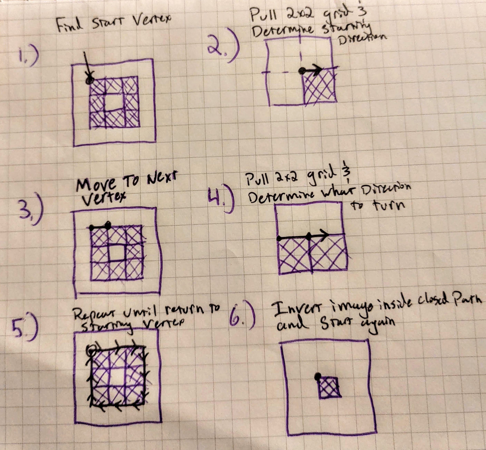
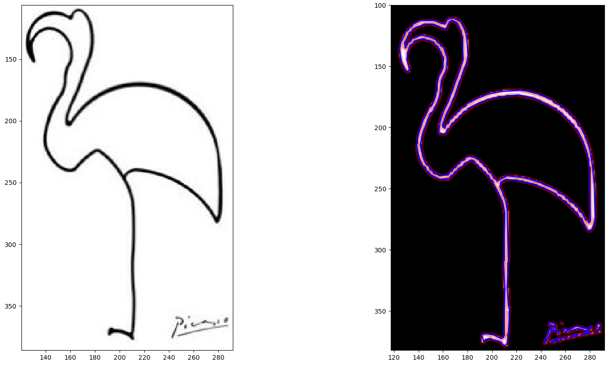

# Image Trace

## Overview

The first set of functionality I wrote for the plotter application is a set of modules for converting raster images to closed-loop polygon vector representations.  Initially I planned to implement the whole [PoTrace algorithm](http://potrace.sourceforge.net/potrace.pdf), but I ended up only using the path-construction method described in section 2.1. I chose to write my own method for converting the paths generated into optimized polygons for the sake of efficiency; the method described in the PoTrace paper is time complexity O(N^3).

## General Work-flow

First, a binary array representation of an image must be generated. There are a couple good ways to create these; I'm initially only concerned with black line drawings on white paper, so I simply filter the initial image by brightness. One could also separate a greyscale image into a couple different color bands and run each of those, or use canny-edge detection on a color image to generate a set of contours. The only important thing is that the array must be binary, I.E. made of only values of 1 and 0. Below is an example of both canny-edge detection (left of original) and a brightness threshold (right of original) applied to a image of a pen doodle. Either resulting array would work.

#### outline_path.*outline_outer_image()*  

This binary array is then passed into the outline_outer_image() method in the outline_path module. The *outline_outer_image()* method recursively traces all of the outlines in the image, creating a directed graph representation of each path. Below is a simplified version of the path tracing algorithm:

Below is a representation of the resulting set of vertexes. Note the areas that are left untraced; one of the arguments that can be passed into the method is "min_path_length", which will throw out any paths less than the given length. This works as a method of de-specking. If no value is passed in, "min_path_length" is calculated automatically as one tenth of the perimeter of the image array bounds. 

The resulting path will always be a closed path. At some point, I'd like to implement a way to trace open paths like the pen doodle from above as open paths.

#### path_to_poly.*path_to_polygon()* 

Next we take our list of paths and pass each of the paths into the path_to_polygon() method (Note that *path_to_polygon()* works on one path at a time. *paths_to_polys()* will iterate through a list of paths). The *path_to_polygon()* method iterates through all vertexes in the path, and removes all vertexes closely approximated by a line from a prior vertex to a later one. This leaves us with a optimized polygon that is a very close approximation of the initial border in the raster image. The error of approximation can be adjusted with the "distance_threshold" argument; smaller values yield a closer approximation, but a longer path. If no value is given, this is calculated to be the square root of the path length divided by 60, a function that was determined experimentally to work pretty well. Below is an image of a set of polygon optimized with this threshold function (polygon outlined in blue).

## Constituent Modules

#### outline_path

* outline_outer_image (img, path_num, min_path_length, fig, start_row, loading_bar)

  Takes in a 

* img_to_bool_array

